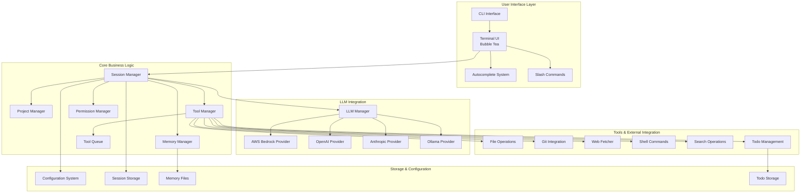
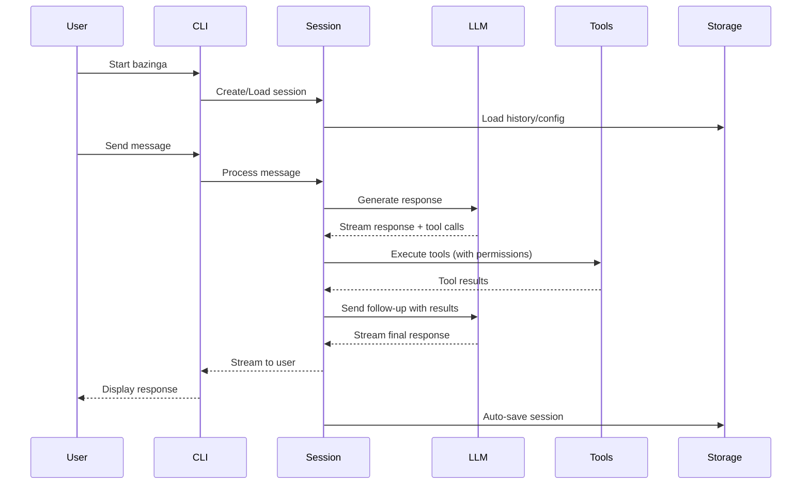
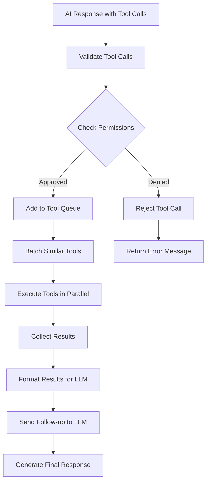

# Bazinga Architecture

This document provides a comprehensive overview of Bazinga's architecture, helping developers understand the system design and navigate the codebase effectively.

## 📋 Table of Contents

- [High-Level Architecture](#high-level-architecture)
- [Core Systems](#core-systems)
- [Data Flow](#data-flow)
- [Key Components](#key-components)
- [Extension Points](#extension-points)
- [Performance Considerations](#performance-considerations)

## 🏗 High-Level Architecture



## 🔄 Data Flow

### Session Lifecycle



### Tool Execution Flow


## 🔧 Key Components

### 1. Session Management (`internal/session/`)

The session system is the heart of Bazinga, managing conversation state, tool execution, and context.

**Key Files:**
- `session.go` - Core session data structure and operations
- `manager.go` - Session lifecycle (create, save, load, resume)
- `context.go` - Intelligent context management for LLM conversations
- `stream.go` - Streaming response handling
- `exec.go` - Tool execution orchestration

**Responsibilities:**
- Maintain conversation history
- Manage tool execution queue
- Handle streaming responses
- Persist session data
- Context optimization for LLM requests

### 2. Tool System (`internal/tools/`)

Extensible tool system providing AI access to external capabilities.

**Architecture:**
```go
type Tool interface {
    Name() string
    Description() string
    InputSchema() interface{}
    Execute(ctx context.Context, input interface{}) (interface{}, error)
}

type ToolExecutor struct {
    tools map[string]Tool
    queue *ToolQueue
    permissions *PermissionManager
}
```

**Tool Categories:**
- **File Tools**: Read, write, edit, create, move, copy, delete files/directories
- **Search Tools**: Grep (ripgrep), find, fuzzy search (fzf)
- **Git Tools**: Status, diff, add, commit, log, branch operations
- **System Tools**: Bash command execution with timeouts
- **Web Tools**: HTTP fetching with security measures
- **Todo Tools**: Task management and tracking

### 3. LLM Provider System (`internal/llm/`)

Abstracted provider system supporting multiple LLM services.

**Provider Interface:**
```go
type Provider interface {
    Name() string
    GenerateResponse(ctx context.Context, req *GenerateRequest) (*Response, error)
    StreamResponse(ctx context.Context, req *GenerateRequest) (<-chan *StreamChunk, error)
    GetAvailableModels() []Model
    SupportsFunctionCalling() bool
    EstimateTokens(text string) int
    GetTokenLimit() int
    Close() error
}
```

**Supported Providers:**
- **AWS Bedrock**: Enterprise-grade with multiple auth methods
- **OpenAI**: GPT models with function calling
- **Anthropic**: Claude models with advanced reasoning
- **Ollama**: Local inference for privacy and cost control

### 4. Permission System (`internal/session/permissions.go`)

Security system that controls tool execution based on risk assessment.

**Risk Levels:**
- **Low Risk (Auto-approved)**: File reading, search operations, git status
- **Medium Risk (Prompt)**: File writing, editing, todo management
- **High Risk (Prompt)**: File deletion, bash commands, git commits

**Features:**
- Contextual risk analysis
- Session-based permission memory
- Audit logging
- Terminator mode bypass (development only)

### 5. Memory System (`internal/memory/`)

Hierarchical memory system for persistent context across sessions.

**Memory Types:**
- **User Memory** (`~/.bazinga/MEMORY.md`): Global preferences and style
- **Project Memory** (`./MEMORY.md`): Project-specific context and guidelines
- **Import System**: Include external documentation via `@path/to/file.md`

### 6. User Interface (`internal/ui/`)

Bubble Tea-based terminal interface with rich interactions.

**Components:**
- **Chat Interface**: Message display with markdown rendering
- **Autocomplete**: Command suggestion system
- **Diff Viewer**: Git change visualization
- **Status Display**: Tool execution progress
- **Permission Prompts**: Security approval dialogs

## 🔌 Extension Points

### Adding New Tools

1. Implement the `Tool` interface in `internal/tools/`
2. Register the tool in `GetAvailableTools()` 
3. Add appropriate risk level in permission system
4. Add tests in `tools_test.go`

**Example:**
```go
type MyTool struct{}

func (t *MyTool) Name() string { return "my_tool" }
func (t *MyTool) Description() string { return "Does something useful" }
func (t *MyTool) InputSchema() interface{} { return MyToolInput{} }
func (t *MyTool) Execute(ctx context.Context, input interface{}) (interface{}, error) {
    // Implementation
}
```

### Adding New LLM Providers

1. Create new provider package in `internal/llm/`
2. Implement the `Provider` interface
3. Add configuration in `internal/config/config.go`
4. Register in `internal/cli/root.go`
5. Add tests and documentation

### Adding New Slash Commands

1. Create command in `internal/ui/commands/`
2. Implement the `Command` interface
3. Register in command registry
4. Add help text and autocomplete

## ⚡ Performance Considerations

### Context Management

- **Intelligent Truncation**: Automatically manages context size for LLM limits
- **Sliding Window**: Keeps recent context while preserving important messages
- **Memory Integration**: Includes relevant memory without bloating context

### Tool Execution

- **Parallel Execution**: Independent tools run concurrently
- **Batching**: Similar operations grouped for efficiency
- **Timeouts**: Prevents hanging operations (30s for bash commands)
- **Resource Limits**: File size limits (10MB for web fetches)

### Storage

- **JSON Persistence**: Fast session serialization
- **Incremental Saves**: Auto-save after significant events
- **Cleanup**: Automatic cleanup of old sessions and temporary files

### Memory Usage

- **Streaming**: Responses streamed to UI without buffering entire content
- **Lazy Loading**: Sessions loaded on demand
- **Resource Cleanup**: Proper cleanup of goroutines and file handles

## 🔗 Inter-Component Communication

### Event Flow

1. **User Input** → CLI → UI → Session
2. **LLM Request** → Session → LLM Manager → Provider
3. **Tool Calls** → Session → Tool Executor → Permission Manager → Tools
4. **Responses** → Session → UI → User

### State Management

- **Session State**: Centralized in session manager
- **UI State**: Managed by Bubble Tea model
- **Configuration State**: Global config with environment overrides
- **Permission State**: Per-session permission memory

### Error Handling

- **Graceful Degradation**: Fallback behaviors for provider failures
- **Error Propagation**: Structured error handling with context
- **User Feedback**: Clear error messages in UI
- **Logging**: Comprehensive logging for debugging

---

This architecture enables Bazinga to be:
- **Extensible**: Easy to add new tools, providers, and commands
- **Secure**: Robust permission system with risk assessment
- **Performant**: Efficient streaming and parallel execution
- **Maintainable**: Clear separation of concerns and interfaces
- **User-Friendly**: Rich terminal interface with intelligent context management