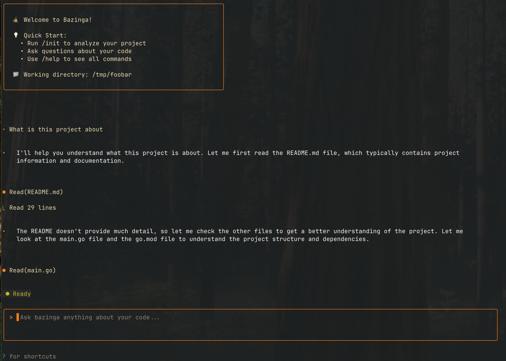

# Bazinga

[](https://golang.org)
[](LICENSE)
[](ARCHITECTURE.md)


⚠️ **Disclaimer:** This is an experimental tool in early alpha stage. It's a fun side project intended for exploration and learning the LLMs workflows, not recommended for production environments. Use at your own risk.

Bazinga is a Claude Code clone written in Go that brings the power of Large Language Models directly to your terminal development workflow. This agentic coding assistant provides intelligent project analysis, multi-provider LLM support, and a streamlined experience for developers. Fun fact: Claude Code itself was used to write this clone!




## ✨ Key Features

- 🤖 **Multi-Provider LLM Support** - AWS Bedrock, OpenAI, Anthropic, and Ollama
- 🎯 **Intelligent Project Analysis** - Automatic project detection and file selection  
- 🛡️ **Smart Permission System** - Risk-based tool execution with security controls
- 📋 **Advanced Todo Management** - Built-in task tracking with visual progress
- 🧠 **Persistent Memory System** - Project and user-specific context retention
- ⚡ **Streaming Responses** - Real-time AI interaction with tool execution
- 🔍 **Comprehensive Tool Suite** - File operations, Git integration, search, and more
- 💾 **Session Persistence** - Save and restore coding sessions across restarts

## 🚀 Quick Start

### Installation

**Option 1: Using Make (Recommended)**
```bash
git clone https://github.com/tildaslashlef/bazinga.git
cd bazinga
make install
```

**Option 2: From Source**
```bash
git clone https://github.com/tildaslashlef/bazinga.git
cd bazinga
make build
sudo mv bin/bazinga /usr/local/bin/
```

**Option 3: Go Install**
```bash
go install github.com/tildaslashlef/bazinga/cmd/bazinga@latest
```

### Setup

1. **Configure your LLM provider** (choose one):
```bash
# For AWS Bedrock
export AWS_PROFILE=your-profile

# For OpenAI  
export OPENAI_API_KEY=your-key

# For Anthropic
export ANTHROPIC_API_KEY=your-key

# For Ollama (local)
ollama serve  # Start Ollama service
```

2. **Start Bazinga in your project**:
```bash
cd your-project
bazinga
```

3. **Initialize project analysis**:
```
/init
```

4. **Start coding with AI**:
```
"Analyze this codebase and suggest improvements"
"Add error handling to the main function"  
"Help me implement user authentication"
```

## 💡 Core Concepts

### Smart Project Analysis

Bazinga automatically detects your project type and loads the most relevant files:

```bash
/init  # Analyzes project structure and loads key files
```

- **Go Projects**: `main.go`, `go.mod`, key packages
- **Node.js**: `package.json`, `index.js`, main modules  
- **Python**: `main.py`, `requirements.txt`, core modules
- **And more**: Rust, Java, C++, web projects

### Intelligent Memory System

Bazinga maintains context across sessions using a hierarchical memory system:

- **User Memory** (`~/.bazinga/MEMORY.md`) - Your coding preferences and style
- **Project Memory** (`./MEMORY.md`) - Project-specific guidelines and context
- **Import System** - Include external docs with `@path/to/file.md`

## 🎯 Essential Commands

| Command | Description |
|---------|-------------|
| `/init` | Analyze project and create context |
| `/diff` | Show current Git changes |
| `/commit [message]` | Commit with AI-generated message |
| `/memory` | Manage memory system |
| `/config` | View/update configuration |
| `/help` | Show all available commands |

## 🔧 Configuration

Bazinga uses a simple YAML configuration file at `~/.bazinga/config.yaml`:

```yaml
llm:
  default_provider: "bedrock"  # or "openai", "anthropic", "ollama" 
  default_model: "eu.anthropic.claude-3-7-sonnet-20250219-v1:0"
  
providers:
  bedrock:
    enabled: true
    region: us-west-1
    auth_method: "profile"
    profile: <AWS bedrock profile name> 

  ollama:
    enabled: false
    base_url: "http://localhost:11434"
    model: "qwen2.5-coder:latest"
    
security:
  terminator: false  # NEVER enable in production
```

## 🛠️ Tool System

Bazinga provides 24+ tools for comprehensive development assistance:

**File Operations**: Read, write, edit, create, move, copy, delete  
**Search**: Grep (ripgrep), find, fuzzy search  
**Git**: Status, diff, add, commit, log, branch  
**System**: Bash commands (with timeouts)  
**Web**: HTTP fetching (with security limits)  
**Todo**: Task management and tracking

All tools include:
- ✅ **Permission System** - Risk-based execution control
- ⏱️ **Timeout Protection** - Prevents hanging operations  
- 🔒 **Sandboxing** - Operations limited to project scope
- 📝 **Audit Logging** - Full execution history

## 🛡️ Security

Bazinga includes a comprehensive security system:

- **🟢 Low Risk** (Auto-approved): File reading, search, git status
- **🟡 Medium Risk** (Prompt): File writing, editing
- **🔴 High Risk** (Prompt): File deletion, bash commands, git commits

When prompted, choose:
- `y` - Approve this time
- `n` - Deny this time  
- `a` - Approve and remember for session

## 📚 Documentation

- **[Architecture Guide](ARCHITECTURE.md)** - Detailed system design and navigation

## 🔗 LLM Provider Support

| Provider | Status | Features |
|----------|--------|----------|
| **AWS Bedrock** | ✅ Full | Enterprise auth, multiple models |
| **OpenAI** | ✅ Full | GPT models, function calling |
| **Anthropic** | ✅ Full | Claude models, advanced reasoning |
| **Ollama** | ✅ Full | Local inference, privacy-focused |

## 🎨 Usage Examples

### Basic Development Session
```bash
cd my-go-project
bazinga

/init
"Review the error handling in main.go"
"Add input validation to the API handlers"
/commit "Improve error handling and validation"
```

### Memory Management
```bash
/memory create project
/memory #Use table-driven tests for all new code
/memory #Prefer context.Context for cancellation
/memory show
```

### Multi-Provider Workflow
```bash
# Use Ollama for local development
bazinga --provider ollama --model qwen2.5-coder:latest

# Switch to Claude for complex reasoning
/config provider anthropic
```

## 📄 License

This project is licensed under the MIT License - see the [LICENSE](LICENSE) file for details.
